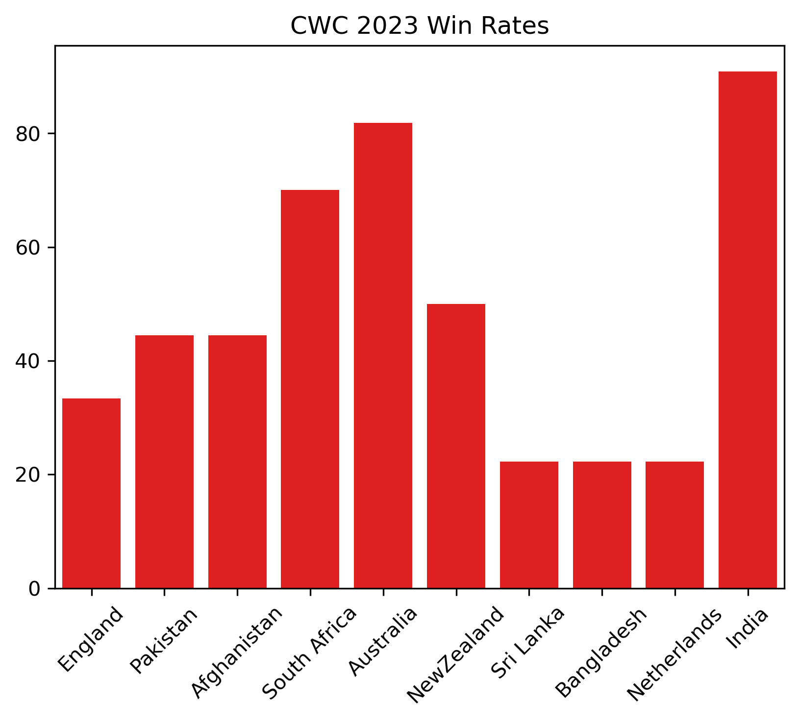

# Cricket_World_Cup_2023
## Objective
I extracted, cleaned, analyzed and visualized this dataset to get some meaningful insights. The main objective was to learn something about the cricket world cup 2023. Many questions come to our mind, Especially when you are a cricket fan. Often thoughts like which team has the highest win rate? Does the stadium has an affect on the win rate? Does the toss winner was related to winning?. 

## Dataset
Cricket World Cup 2023 dataset comprises of match-specific details such as Match ID, date, time, city, stadium, participating teams (Team A and Team B), toss winner, and their decision. It includes scores, wickets, overs bowled, boundaries (fours and sixes), run rates, and extras (leg byes, wides, etc.) for both teams. Notable columns feature match outcomes, margin (runs or wickets), and key officials. This data allows in-depth analysis of team performance, batting and bowling statistics, aiding insights into match results and player contributions across various games.

## Tools Used
1. Jupyter Notebook
2. Python

## Methodology
1. Data extraction and inspection.
2. Data Cleaning (Handling missing or null values).
3. Explorartory Analysis and getting meaningful insights.
4. Visualization of key insights.

## Key Questions
1. Which team has the highest win rate in CWC 2023? (Is there a Momentum effect?)
2. Does winning the toss increse winning chances?
3. Average runrates of each team.

## Results

1.Which team has the highest win rate in CWC 2023? (Is there a Momentum effect?)
Ans. following is the bar plot showing the win rate of each team throughout the world cup:
     
